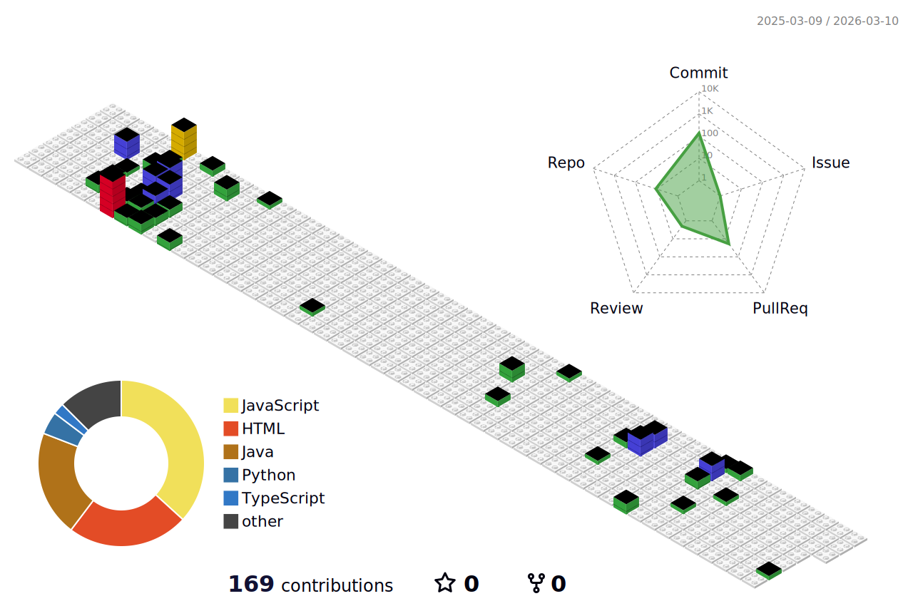

<div align="center">

<!-- ============ HEADER ============ -->


[](https://linkedin.com/in/Parth111)
[](mailto:parthpatel.cse@gmail.com)
[](#)
[](#)


<h3 align="center">
🎯 <b>SEEKING:</b> Full-Stack Engineer | Backend Engineer | DevOps Engineer | Cloud Engineer
<br/>
📍 Tempe, Arizona | 🎓 MS Software Engineering @ ASU | Graduating May 2026
</h3>

</div>

---

<!-- ============ GITHUB STATS & ACTIVITY - FIRST THING RECRUITERS SEE ============ -->

## 📊 GitHub Statistics & Activity

<div align="center">

<!-- SEPARATOR COMMENT -->

### 📈 Performance Metrics


<!-- SEPARATOR COMMENT -->

### 🏆 Achievements


<!-- SEPARATOR COMMENT -->

### 📅 3D Contribution Calendar



<!-- SEPARATOR COMMENT -->

### 🐍 Contribution Snake


<!-- SEPARATOR COMMENT -->

</div>

---

<!-- ============ IMPACT METRICS ============ -->

<div align="center">

## 💥 Proven Impact

<table>
<tr>
<td align="center" width="33%">

### ⚡ Performance
```
3000 TPS
<50ms latency
99.9% uptime
```

</td>
<td align="center" width="33%">

### 📈 Scale
```
10,000+ users
95% payload reduction
40% faster response
```

</td>
<td align="center" width="33%">

### 🔧 Quality
```
68% code coverage
500+ bugs fixed
Full SDLC ownership
```

</td>
</tr>
</table>

</div>

---

<!-- ============ TECH STACK ============ -->

## 🛠️ Tech Stack

<details open>
<summary><b>💻 Frontend & UI</b></summary>
<br/>


**Proficiency:** ████████████████████░ 95%

</details>

<details open>
<summary><b>⚙️ Backend & APIs</b></summary>
<br/>


**Proficiency:** ██████████████████░░ 90%

</details>

<details open>
<summary><b>☁️ DevOps & Cloud</b></summary>
<br/>


**Proficiency:** ███████████████████░ 92%

</details>

<details open>
<summary><b>🗄️ Databases & Streaming</b></summary>
<br/>


**Proficiency:** ██████████████████░░ 88%

</details>

---

<!-- ============ FEATURED PROJECTS ============ -->

## 🚀 Featured Projects

<div align="center">

<!-- SEPARATOR COMMENT -->

<table>
<tr>
<td width="50%">

### 🚀 DeployMate
**Production DevOps Dashboard**

[](https://github.com/Parth-Patel007/deploymate)

```yaml
Stack:
  - Spring Boot + React
  - Docker + Terraform
  - AWS ECS Fargate
  - Prometheus + Grafana

Achievements:
  ✅ 99.9% uptime
  ✅ 68% test coverage
  ✅ Full CI/CD pipeline
  ✅ Real-time monitoring
```

**Impact:** Enterprise-grade deployment automation with observability

</td>
<td width="50%">

### 🤖 LLM From Scratch
**124M Parameter Transformer**

[](https://github.com/Parth-Patel007/LLM-From-Scratch)

```yaml
Stack:
  - Python + PyTorch
  - Custom BPE Tokenizer
  - Transformer Architecture
  - Docker

Features:
  ✅ 124M parameters
  ✅ 5.5K+ samples
  ✅ Multi-head attention
  ✅ Position embeddings
```

**Impact:** Deep learning implementation showcasing ML engineering

</td>
</tr>
<tr>
<td width="50%">

### 📊 Agile Metrics
**Code Quality Platform**

[](https://github.com/Mrunal2148/ser516-group-java-2)

```yaml
Stack:
  - React + Java + Python
  - Docker + CI/CD
  - Multi-language analysis

Metrics:
  ✅ Fog Index
  ✅ Defect tracking
  ✅ Comment coverage
  ✅ Complexity analysis
```

**Impact:** Actionable code quality insights for dev teams

</td>
<td width="50%">

### ♟️ Chess Video Chat
**Real-time P2P Gaming**

[](https://github.com/Parth-Patel007/chess-video-chat)

```yaml
Stack:
  - React 18 + TypeScript
  - WebRTC (P2P)
  - Firebase Realtime DB
  - Chess.js

Performance:
  ✅ <100ms board sync
  ✅ <1s video latency
  ✅ Peer-to-peer arch
```

**Impact:** Sub-100ms multiplayer with video integration

</td>
</tr>
</table>

<!-- SEPARATOR COMMENT -->

### 💼 More Projects

<table>
<tr>
<td align="center" width="33%">

**💳 Digital Payments**

`MERN` `JWT` `Zod`

Security-first payment platform

[](#)

</td>
<td align="center" width="33%">

**🛡️ Payshield Integration**

`Spring Boot` `Kafka` `Redis`

3000 TPS fraud detection

[](#)

</td>
<td align="center" width="33%">

**📱 Insurance App**

`MERN` `Material-UI`

10,000+ daily users

[](#)

</td>
</tr>
</table>

</div>

---

<!-- ============ PROFESSIONAL EXPERIENCE ============ -->

## 💼 Professional Experience

<table>
<tr>
<td width="50%">

### 🏢 IndiaNIC Private Limited
**Software Development Intern** • `Feb 2024 - June 2024`

**🎯 Key Wins:**

- ⚡ **API Optimization:** 1s → 300ms (70% faster), 95% payload reduction
- 📈 **User Engagement:** +23% through UI/UX overhaul & accessibility
- 🐛 **Code Quality:** Fixed 500+ SonarQube issues
- 🔧 **Full-Stack:** C#/.NET debugging, React refactoring

**Stack:** `React` `C#` `.NET` `SQL Server` `SonarQube`

</td>
<td width="50%">

### 🏢 Emerging Five Pvt Ltd
**Software Development Intern** • `April 2023 - July 2023`

**🎯 Key Wins:**

- 👥 **Scale:** Built app serving 10,000+ users, 35% efficiency gain
- 📊 **UX Impact:** +25% engagement, -20% data-entry errors
- ✅ **Quality:** -40% post-deployment bugs via Jest + Postman
- 🔗 **Integration:** RESTful APIs with robust validation

**Stack:** `MongoDB` `Express` `React` `Node.js` `Jest`

</td>
</tr>
</table>

---

<!-- ============ WHAT SETS ME APART ============ -->

<div align="center">

## 💎 What Sets Me Apart

<table>
<tr>
<td width="33%" align="center">

### 🚀 **PRODUCTION-READY**

```
Every project ships with:
├─ 🔄 CI/CD pipelines
├─ 🧪 Multi-layer testing
├─ 📊 Monitoring & alerts
└─ 🏗️ Infrastructure as Code
```

I don't just code—I ship systems that scale.

</td>
<td width="33%" align="center">

### ⚡ **PERFORMANCE OBSESSED**

```
Real optimization wins:
├─ 1000ms → 300ms API
├─ 95% payload reduction
├─ <50ms fraud detection
└─ 3000 TPS throughput
```

Performance is architected from day one.

</td>
<td width="33%" align="center">

### 🔄 **FULL-CYCLE OWNERSHIP**

```
End-to-end expertise:
├─ 💻 React components
├─ ⚙️ Spring Boot APIs
├─ ☁️ AWS infrastructure
└─ 📊 Observability
```

From design to production monitoring.

</td>
</tr>
</table>

</div>

---

<div align="center">


**Made with ❤️ by Parth Patel • Always learning, always building**


</div>
